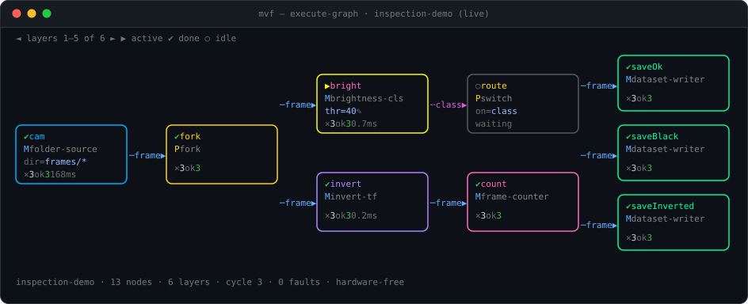

# MachineVisionFabric

[](https://github.com/hmetgundogdu/machine-vision-fabric/actions/workflows/ci.yml)
[](https://github.com/hmetgundogdu/machine-vision-fabric/releases)
[](LICENSE)

**MachineVisionFabric (MVF)** is an open-source, high-performance **polyglot pipeline engine**.
You compose a strict, typed graph of processing nodes — and write those nodes in **.NET, Python,
or C++**, mixing languages freely in the same pipeline. Typed payloads — images, tensors, raw
blobs, or any data/signal — move between nodes **zero-copy through a shared-memory arena**: no
serialization, no base64, so a Python node and a C++ node hand off a tensor at memory speed. Data
flow and control flow are separate, typed edges. It runs self-contained at the edge; a central
server is optional and only ever observes.

<p align="center">
  
</p>

Above is the CLI's **live graph dashboard** running `packages/inspection-demo` — a 13-node graph
(folder-source simulator → fork → Python brightness/counter + invert workers → switch → routed
dataset sinks) executing end-to-end with **no hardware**. Node boxes are colour-coded by
category, show their live config and per-node stats, and the executing node is highlighted; the
**log panel** underneath streams every node execution, timing, and recovery event as it happens.
Full walkthrough: [**CLI guide**](docs/cli-guide.md).

## Why MVF

- **Polyglot, one protocol** — write a node in **.NET, Python, or C++** and mix them in one graph;
  they all speak the same stdio control + shared-memory data contract.
- **High performance** — typed payloads live in a shared-memory arena and are read/written **in
  place (zero-copy, no base64)**; a pipelined, parallel executor keeps stages busy and joins
  multiple inputs.
- **Strict typed graph** — every edge is typed and schema-validated at runtime, not just in a UI:
  `NODE(typed output) → NODE(typed input)`.
- **Data flow ≠ control flow** — payload transfer (**data edges**) and decisions/signals
  (**control edges**) are separate first-class link types, never collapsed.
- **Any payload** — images, tensors (dtype + shape), raw blobs, or JSON; the descriptor is
  self-describing, so a node always knows the type it receives.
- **Runs anywhere, nothing to install to try** — self-contained at the edge, no central server;
  simulator sources ship in-box so the demos run with no hardware attached.

See [`docs/architecture-foundation.md`](docs/architecture-foundation.md) and
[`docs/roadmap.md`](docs/roadmap.md) for the full design.

## Repository layout

```text
machine-vision-fabric/
├── src/
│   ├── core/            Mvf.Graph (typed graph + validation), Mvf.Abstractions (contracts)
│   ├── engine/          Mvf.Engine (pipelined scheduler, checkpoint/restore, backpressure)
│   ├── hosting/         Mvf.Hosting.Worker (out-of-process module host)
│   ├── transports/      Mvf.Transport.SharedMemory (zero-copy data plane)
│   ├── sdk/
│   │   ├── dotnet/      Mvf.Sdk         → NuGet:  MachineVisionFabric.Sdk
│   │   ├── python/      mvf_sdk         → wheel:  mvf-sdk
│   │   └── cpp/         mvf/sdk.hpp     → lib:    libmvf_sdk.{so,dylib} / mvf_sdk.dll
│   └── cli/             Mvf.Cli (headless host + live TUI dashboard)
├── modules/             integration modules (.NET + Python) discovered at runtime
├── packages/            runnable pipeline packages (pipeline.json)
├── tools/               Mvf.SchemaExporter
├── tests/               engine test suite
└── protocol/            the language-agnostic module wire protocol
```

## Install

### Download the CLI (no .NET required)

Grab a single self-contained executable for your OS from the
[latest release](https://github.com/hmetgundogdu/machine-vision-fabric/releases/latest):

| OS | Asset |
|---|---|
| Linux | `mvf-cli-linux-x64` |
| macOS (Apple Silicon) | `mvf-cli-osx-arm64` |
| Windows | `mvf-cli-win-x64.exe` |

```bash
chmod +x mvf-cli-linux-x64
./mvf-cli-linux-x64 packages
```

### Build from source

Requires the .NET SDK pinned in `global.json` (.NET 10).

```bash
dotnet build Mvf.slnx -c Release
dotnet run --project src/cli/Mvf.Cli -- packages
```

## Quickstart

```bash
# List runnable pipeline packages and discovered modules
dotnet run --project src/cli/Mvf.Cli -- packages
dotnet run --project src/cli/Mvf.Cli -- modules

# Validate a pipeline graph
dotnet run --project src/cli/Mvf.Cli -- validate-pipeline --path packages/inspection-demo/pipeline.json

# Run the inspection demo — live TUI dashboard
dotnet run --project src/cli/Mvf.Cli -- execute-graph --package packages/inspection-demo

# ...or headless (as in the screenshot): plain output, stop after N cycles
dotnet run --project src/cli/Mvf.Cli -- execute-graph --package packages/inspection-demo --no-tui --max-cycles 3
```

The A→Z walkthrough — every command, the **`loop`** primitive that makes a pipeline iterate, and
driving a run live (pause, node navigation, live edits) — is in the [**CLI guide**](docs/cli-guide.md).

### Demo packages (hardware-free)

| Package | Shows |
|---|---|
| `inspection-demo` | 13-node inspection graph, polyglot workers, routed dataset sinks |
| `loop-demo` | graph iteration authority (`loop` primitive, whole-graph pause) |
| `value-demo` | typed value / select primitives |
| `multilang-demo` | .NET + Python nodes in one graph |
| `py-brightness-demo`, `py-invert-demo` | single Python classifier / transformer |

## Write a module (Python · .NET · C++)

A node is a small program that receives a typed payload and returns a result — a **processor**
(new payload out), a **classifier** (a label/signal for `if`/`switch` routing), a **source**, or a
**sink**. All three SDKs speak the [same protocol](protocol/README.md), so the language is your
choice and nodes interoperate in one graph. The steps below are the same shape in every language.

### 1 · Get the SDK

| Language | Install | `runtime` tag |
|---|---|---|
| Python | `pip install mvf-sdk` | `python` |
| .NET | NuGet `MachineVisionFabric.Sdk` | `dotnet` (in-process) |
| C++ | link `libmvf_sdk` — [`src/sdk/cpp`](src/sdk/cpp) | `native` |

### 2 · Write the node

A processor gets a zero-copy `payload` (bytes, or an image/tensor) and returns a new one:

```python
# Python — pip install mvf-sdk
from mvf_sdk import run_processor, blob

def transform(payload, meta):
    return blob(bytes(255 - b for b in payload.memory))   # any transform over the payload

run_processor("py.invert", transform)
```

```cpp
// C++ — link libmvf_sdk
#include "mvf/sdk.hpp"
using namespace mvf;
int main() {
    return run_processor("cpp.invert",
        [](const Payload& in, const json&) -> std::optional<Output> {
            std::string out(in.size, '\0');
            for (size_t i = 0; i < in.size; ++i) out[i] = static_cast<char>(255 - in.data[i]);
            return blob(std::move(out));
        });
}
```

```csharp
// .NET — reference MachineVisionFabric.Sdk (bases: FrameSource/Processor/Classifier/SinkModuleBase)
public sealed class BrightnessGate : FrameProcessorModuleBase<Options>
{
    protected override IntegrationModuleDescriptor BuildDescriptor() =>
        IntegrationModuleDescriptorBuilder.CreateProcessor<Options>(
            "net.brightness-gate", "Brightness Gate", "1.0.0", "brightness-gate", "…");

    protected override IFrameProcessor CreateProcessor(Options o) => new Gate(o);
}
```

### 3 · Declare it — `module.json`

```json
{ "id": "cpp.invert", "kind": "processor", "runtime": "native", "entry": "mvf_invert" }
```

`runtime` picks the launcher and what `entry` points at: `python` → the `.py`, `native` → the
compiled binary, `dotnet` → the `.dll`.

### 4 · Wire it into a pipeline — `pipeline.json`

Reference the module by `id` on a node and connect typed ports with edges:

```json
{
  "name": "my-pipeline",
  "nodes": [
    { "id": "cam",    "module": "mvf.folder-source",  "config": { "sourceFolder": "frames" } },
    { "id": "invert", "module": "cpp.invert" },
    { "id": "save",   "module": "mvf.dataset-writer",  "config": { "outputRoot": "out" } }
  ],
  "edges": [
    { "from": "cam.frame",    "to": "invert.frame" },
    { "from": "invert.frame", "to": "save.frame" }
  ]
}
```

The data graph is a strict DAG, so this runs **one pass**. To replay the folder or run continuously,
add a `loop` node and close the tail back to it (`{ "from": "save", "to": "cycle" }`) — the loop owns
iteration and whole-graph pause. See the [**CLI guide**](docs/cli-guide.md) for the loop model and
driving a run live.

### 5 · Run it

```bash
mvf execute-graph --package my-package
```

The engine discovers the module, launches it (in-process for `dotnet`, as a supervised worker for
`python`/`native`), streams frames through the shared-memory arena, and shows every node live in the
dashboard. Full runnable examples:
[Python](modules/py-invert-transformer) · [.NET](modules/dotnet-brightness-gate) ·
[C++](src/sdk/cpp/examples) · deeper guide: [`docs/sdk-quickstart.md`](docs/sdk-quickstart.md).

## Releases & CI

- **CI** (`.github/workflows/ci.yml`) runs on every push/PR: builds + tests the .NET solution
  (with Python for the module-spawning tests), builds the Python wheel, and compiles the C++
  SDK on Linux/macOS/Windows.
- **Release** (`.github/workflows/release.yml`) runs on a `v*` tag and publishes, all versioned
  from the tag:
  - `.nupkg` — `MachineVisionFabric.Sdk`
  - `.whl` + sdist — `mvf-sdk`
  - `mvf-sdk-cpp-<ver>-{linux-x64,osx-arm64,win-x64}.zip` — C++ shared library + header
  - `mvf-cli-{linux-x64,osx-arm64,win-x64}` — self-contained single-file CLI

Cut a release by tagging: `git tag v0.1.2 && git push origin v0.1.2`.

## Documentation

- [CLI Guide](docs/cli-guide.md) — run pipelines A→Z, the `loop` primitive, live control
- [Architecture Foundation](docs/architecture-foundation.md)
- [Pipeline Graph Foundation](docs/pipeline-graph-foundation.md)
- [Integration SDK Strategy](docs/integration-sdk-strategy.md) · [SDK Quickstart](docs/sdk-quickstart.md)
- [Roadmap](docs/roadmap.md)

## License

[Apache-2.0](LICENSE)
